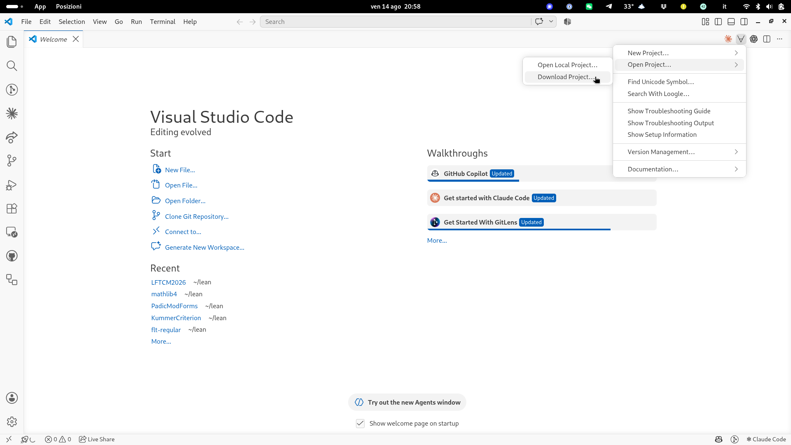
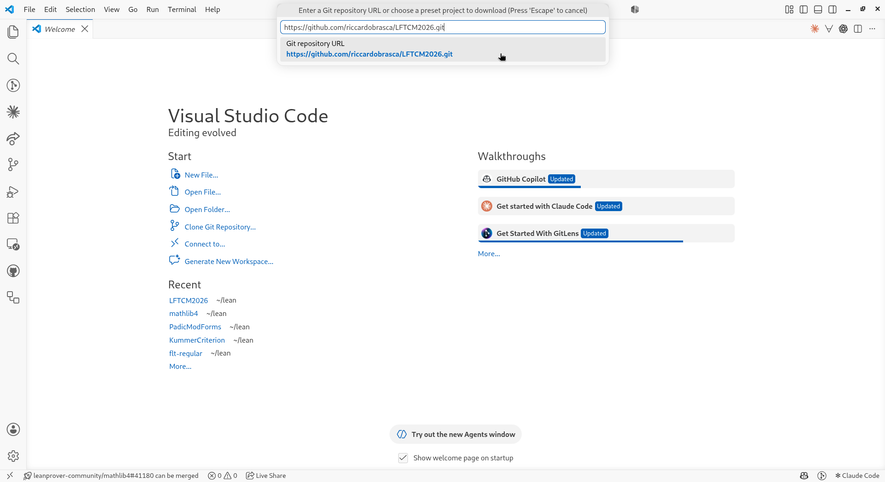
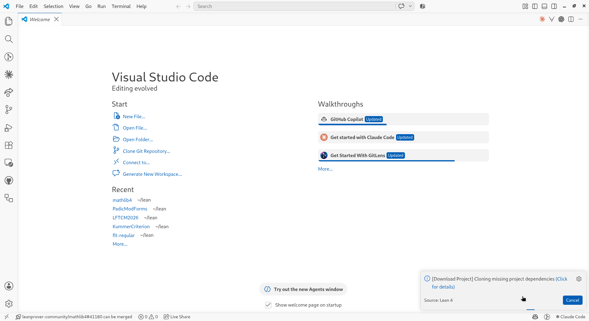
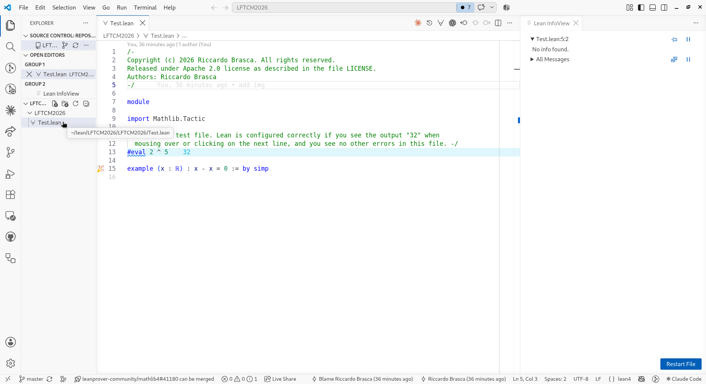
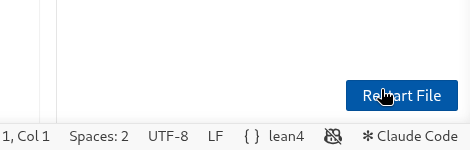

# Lean For The Curious Mathematician 2026

[](https://github.com/riccardobrasca/LFTCM2026/actions/workflows/lean_action_ci.yml)

This is the repository for the workshop *Lean For The Curious Mathematician 2026*.
All the files needed during the talks are in the subfolder `LFTCM2026`.

## Repository contents

TBA

## Installation

First install Lean, Git and VS Code (with the Lean 4 extension) by following these
[instructions](https://lean-lang.org/install/). You do *not* need the last step, creating a Lean
project: instead get this repository in one of the two ways below.

Either way you will download mathlib, so make sure you have enough free disk space: the repository
takes about 8 GB, on top of roughly 3 GB for Lean itself.

### Get the repository using VS Code

* Open VS Code. In the top-right (or top-middle) of the screen there is a Lean menu marked by `∀`.
  Choose `Open Project... > Project: Download Project`. If you don't see the `∀`, the Lean
  extension is not installed; go back to the previous step or ask for help.

  

* Enter `https://github.com/riccardobrasca/LFTCM2026.git` and press enter. Note that VS Code
  suggests downloading mathlib, which is *not* this repository.

  

* Choose a folder name (for example `LFTCM2026`). This downloads the project, including mathlib,
  and will take a bit of time.

  

* Press `Open Project Folder` when asked.

### Get the repository using a terminal

* Open a terminal (on Windows I recommend `git bash`, installed as part of git) and `cd` to the
  directory where you want the `LFTCM2026` folder to live. Then run:

  ```
  git clone https://github.com/riccardobrasca/LFTCM2026.git
  cd LFTCM2026
  lake exe cache get!
  lake build
  ```

  `lake exe cache get!` downloads mathlib and takes a bit of time. `lake build` should then take
  less than a minute; if it produces more than a few lines of output you are rebuilding mathlib
  from scratch, which means `lake exe cache get!` went wrong. Stop it with `Ctrl c` and ask for
  help.

* On Windows, if you get an error starting with `curl: (35) schannel: next
  InitializeSecurityContext failed`, it is probably your antivirus program objecting to the many
  downloads. The easiest fix is to disable it temporarily.

* Open the folder in VS Code, either from the menu (`File > Open Folder`, just `Open` on a Mac) or
  by running `code .` in the terminal (note the dot). macOS users need a one-off
  [extra step](https://code.visualstudio.com/docs/setup/mac#_launching-from-the-command-line) to
  launch VS Code from the command line.

  Choose the root folder `LFTCM2026`, *not* one of its subfolders.

### Check that everything works

* If VS Code asks `Do you trust the authors of the files in this folder?`, click
  `Yes, I trust the authors`.

* Open `LFTCM2026/Test.lean` using the explorer button in the top-left.

  

* Lean takes 10-40 seconds to start, showing a `Starting Lean language client` pop-up. If the
  pop-up `Imports of 'Test.lean' are out of date and must be rebuilt.` appears, click
  `Restart File`.

  

* If you see a blue squiggle under `#eval`, Lean is running correctly.

### Update the repository

To get the new exercises, open a terminal in your local copy of this repository (e.g.
`cd LFTCM2026`) and run:

```
git pull
```

### Error Lens extension

Optional: some users find it useful to install the `Error Lens` extension, which displays Lean
messages directly in your source file. In the left bar of VS Code, click the `Extensions` button,
then search for and install it. It starts automatically.

## Using Codespaces

If you have trouble installing Lean locally, you can use GitHub Codespaces instead. This works
fine, but not as well as a local installation. It requires a GitHub account, and you can only use
it for a limited amount of time each month. If you are signed in to GitHub, click here:

<a href='https://codespaces.new/riccardobrasca/LFTCM2026' target="_blank" rel="noreferrer noopener"></a>

* Check [your Codespaces settings](https://github.com/settings/codespaces): under `Region`, keep
  `Set automatically` (the default). The environment is prepared in advance for Europe, so a
  codespace created from elsewhere still works, but takes longer to start.
* Press `Create codespace`.
* After a couple of minutes you get a VS Code window in your browser. It may still be setting up
  Lean and mathlib in the background, so wait until the terminal is idle before opening a
  `.lean` file.
* Open `LFTCM2026/Test.lean`. A blue squiggle under `#eval` means Lean is running correctly.

To restart a previous codespace, go to [https://github.com/codespaces/](https://github.com/codespaces/).

## Troubleshooting

If you get the error `unknown package 'Mathlib'` and a red squiggle under `import Mathlib.Tactic`,
you probably didn't open the right folder.

* Make sure you used `File > Open Folder` (*not* `File > Open File`) and selected the root folder
  `LFTCM2026` (or the name you chose during the installation). That folder contains another folder
  also called `LFTCM2026`: you have to select the first one, *not* `LFTCM2026/LFTCM2026`.
* If the error persists you can use Codespaces as described above, and ask for help.

## License

This repository is licensed under the Apache License, Version 2.0. See [LICENSE](LICENSE).
